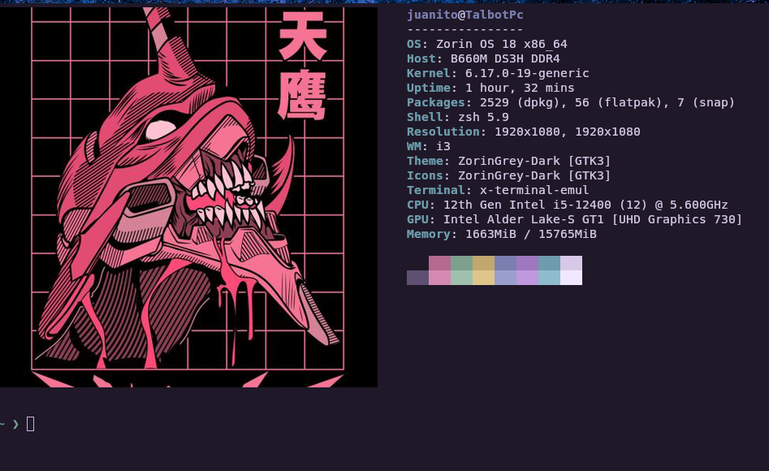

```
# ██████╗  ██████╗ ██████╗      ██████╗ ███████╗        
# ██╔══██╗██╔═══██╗██╔══██╗    ██╔═══██╗██╔════╝        
# ██████╔╝██║   ██║██████╔╝    ██║   ██║███████╗        
# ██╔═══╝ ██║   ██║██╔═══╝     ██║   ██║╚════██║        
# ██║     ╚██████╔╝██║         ╚██████╔╝███████║        
# ╚═╝      ╚═════╝ ╚═╝          ╚═════╝ ╚══════╝        
#                                                       
# ██████╗  ██████╗ ████████╗███████╗██╗██╗     ███████╗ 
# ██╔══██╗██╔═══██╗╚══██╔══╝██╔════╝██║██║     ██╔════╝ 
# ██║  ██║██║   ██║   ██║   █████╗  ██║██║     █████╗   
# ██║  ██║██║   ██║   ██║   ██╔══╝  ██║██║     ██╔══╝   
# ██████╔╝╚██████╔╝   ██║   ██║     ██║███████╗███████╗ 
# ╚═════╝  ╚═════╝    ╚═╝   ╚═╝     ╚═╝╚══════╝╚══════╝ 
#                                                       
# ██╗███╗   ██╗███████╗████████╗ █████╗ ██╗     ██╗     
# ██║████╗  ██║██╔════╝╚══██╔══╝██╔══██╗██║     ██║     
# ██║██╔██╗ ██║███████╗   ██║   ███████║██║     ██║     
# ██║██║╚██╗██║╚════██║   ██║   ██╔══██║██║     ██║     
# ██║██║ ╚████║███████║   ██║   ██║  ██║███████╗███████╗
# ╚═╝╚═╝  ╚═══╝╚══════╝   ╚═╝   ╚═╝  ╚═╝╚══════╝╚══════╝
```

𓆝 𓆟 𓆞 𓆝 𓆟

Personal **Pop_OS!** dotfiles to customize a lightweight, keyboard-driven desktop environment.

## Preview





---
### 📚 i3WM Guide
If you're new to i3 Window Manager, check the official reference card:

https://i3wm.org/docs/refcard.html

---

## Installation

### 1. Clone the repository

Open a terminal and run:

```bash
git clone git@github.com:Talbot-dev/Pop_os-dotfile-config.git
```
Make sure your **GitHub SSH credentials** are configured before cloning.

The repository will be installed on **$HOME** 

### 2. Enter the project directory

```bash
cd Pop_os-dotfile-config
```
### 3. Make the installer executable

```bash
sudo chmod +x popOS.sh
```

### 4. Run the installer

```bash
./popOS.sh
```

The installer now configures:
- `i3` + your custom `~/.config/i3/config`
- `polybar` + autostart via i3 config
- `picom`
- `kitty`
- `rofi` launcher (`Mod+d`)

---
### 🔄 Reboot
Restart your computer and select i3 on the login screen.

If Polybar does not show up after login, run:

```bash
~/.config/polybar/launch.sh
```

#### Enjoy your custom Pop_OS! environment.  ദ്ദി/ᐠ｡‸｡ᐟ\

---

## Uninstallation

If you want to undo all changes and remove the settings installed by this script, run the uninstaller

```bash
sudo chmod +x uninstall_popOS.sh
./uninstall_popOS.sh
```

This will uninstall packages and configuration files and restore the default terminal, if applicable. To fully restore the previous environment, we recommend restarting or logging out after uninstallation.
